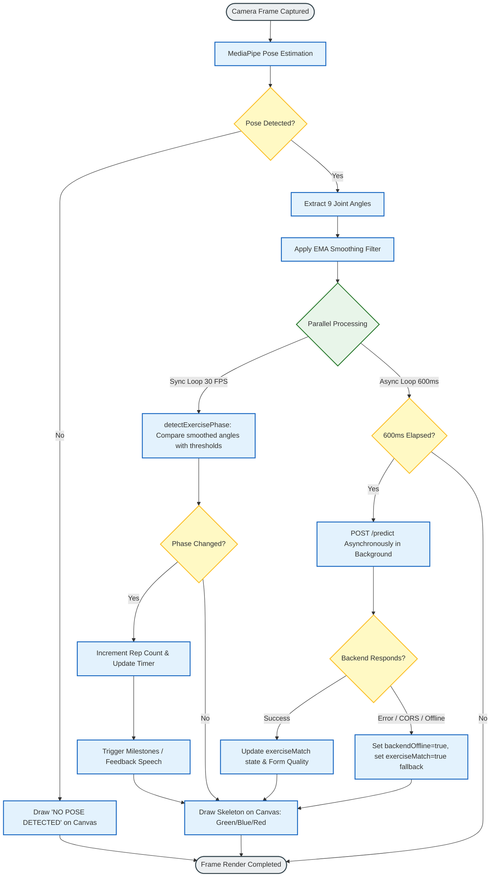

# PhysioTracker System Design & Technical Documentation

This document outlines the **System Architecture**, the **Frame-Processing Flowchart**, and the underlying **Methodology** of the **PhysioTracker** system. It has been prepared for your Engineering Design & Innovation (EDI) project and details how the application achieves high-performance, zero-latency physical rehabilitation tracking.

---

## 1. System Architecture

The **PhysioTracker** system is built on a highly modular Client-Server architecture designed to optimize rendering performance, ensure local responsiveness, and utilize deep-learning models for precise exercise classification.

```mermaid
graph TD
    %% Define Styles
    classDef client fill:#e3f2fd,stroke:#1565c0,stroke-width:2px,color:#0d47a1;
    classDef server fill:#efebe9,stroke:#5d4037,stroke-width:2px,color:#3e2723;
    classDef db fill:#e8f5e9,stroke:#2e7d32,stroke-width:2px,color:#1b5e20;
    classDef engine fill:#fff3e0,stroke:#ef6c00,stroke-width:2px,color:#e65100;

    subgraph Client ["Client Layer (React TypeScript SPA)"]
        UI["User Interface (Dashboard / Exercise Monitor)"]:::client
        MP["MediaPipe Pose Engine (Webcam Frame -> 33 Landmarks)"]:::engine
        EMA["EMA Smoothing Filter (Alpha=0.35)"]:::client
        AE["Angle Extraction Engine"]:::client
        PD["Phase Detection & Hysteresis Counter"]:::client
        Renderer["HTML5 Canvas Live Skeleton Renderer"]:::client
        Cache["Local Storage Session Cache"]:::db
    end

    subgraph Transport ["Network Layer (HTTPS)"]
        REST["REST API Requests (Predict / Log Session)"]
    end

    subgraph Server ["Server Layer (Flask Web API on Render)"]
        Flask["Gunicorn Web Server Workers"]:::server
        CORS_M["Werkzeug CORS Header Manager"]:::server
        Impute["Temporal Frame Padding & Imputation Engine"]:::server
        BiLSTM["BiLSTM Neural Network (TensorFlow/Keras)"]:::server
    end

    subgraph Storage ["Storage Layer"]
        PG["PostgreSQL (Production DB on Render)"]:::db
        SQLite["SQLite (Local Fallback DB with WAL Concurrency)"]:::db
    end

    %% Connections
    UI --> MP
    MP --> AE
    AE --> EMA
    EMA --> PD
    PD --> Renderer
    Renderer --> UI
    
    %% API connections
    EMA -.-->|Asynchronous 600ms batch| REST
    REST --> Flask
    Flask --> CORS_M
    Flask --> Impute
    Impute --> BiLSTM
    
    %% Storage connections
    Flask --> PG
    Flask --> SQLite
    PD -->|On Finish / Save Offline| Cache
    UI -->|Read Cache on Refresh| Cache
    REST -.->|Log sessions to DB| Flask
```

### Architectural Highlights
- **Decoupled Real-Time Core**: Rep-counting, phase detection, joint angle calculations, and skeletal rendering run completely client-side in React at a buttery-smooth **30 FPS**.
- **Asynchronous Deep Learning**: Heavy inference using the 30-frame temporal BiLSTM classifier is performed asynchronously in the background at 600ms intervals, preventing UI freeze or input lag.
- **Fail-Safe High Availability**: If the backend server goes offline or encounters a CORS block, the client enters `Offline Mode`, using local heuristic phase definitions and saving exercise progress in browser `localStorage`.
- **Database Concurrency**: The SQLite storage engine operates in Write-Ahead Logging (WAL) mode, allowing concurrent write and read processes by multi-worker Gunicorn servers on Render.

---

## 2. Frame-Processing Flowchart

The flowchart below traces the processing lifecycle of a single webcam frame through the system. It showcases the decoupled design that keeps local tracking separate from the server-side AI model checks.



---

## 3. Methodology

PhysioTracker combines multi-joint kinematics, real-time signal filtering, and temporal recurrent neural networks to deliver precise, robust clinical assessment.

### A. Biometric Landmark Extraction
Webcam input is processed using **MediaPipe Pose**, a machine-learning model based on the BlazePose architecture. BlazePose tracks **33 3-dimensional skeletal landmarks** ($x, y, z$) in real-time, along with a per-landmark model visibility confidence ($v \in [0.0, 1.0]$).

### B. Trigonometric Joint Angle Extraction
To convert raw $x, y$ coordinates into biomechanical metrics, the system models the human body as a series of connected vectors. For any joint $B$ connected to adjacent landmarks $A$ and $C$, two vectors are defined:
$$\vec{u} = A - B = (x_a - x_b, y_a - y_b)$$
$$\vec{v} = C - B = (x_c - x_b, y_c - y_b)$$

The joint angle $\theta$ (in degrees) is calculated using the dot product and magnitude relations:
$$\cos(\theta) = \frac{\vec{u} \cdot \vec{v}}{\|\vec{u}\| \|\vec{v}\|} = \frac{u_x v_x + u_y v_y}{\sqrt{u_x^2 + u_y^2} \sqrt{v_x^2 + v_y^2}}$$
$$\theta = \arccos\left(\text{clamp}(\cos(\theta), -1.0, 1.0)\right) \times \left(\frac{180}{\pi}\right)$$

This formula is applied to extract **9 distinct joint flexions**:
1. **Left Shoulder** flexion (Hip-Shoulder-Elbow)
2. **Right Shoulder** flexion (Hip-Shoulder-Elbow)
3. **Left Elbow** flexion (Shoulder-Elbow-Wrist)
4. **Right Elbow** flexion (Shoulder-Elbow-Wrist)
5. **Left Hip** flexion (Shoulder-Hip-Knee)
6. **Right Hip** flexion (Shoulder-Hip-Knee)
7. **Left Knee** flexion (Hip-Knee-Ankle)
8. **Right Knee** flexion (Hip-Knee-Ankle)
9. **Spine Angle** (Angle of the shoulder-to-hip vector relative to a vertical gravitational gravity line)

### C. Signal Denoising (EMA Filter)
Webcam video streams suffer from high-frequency coordinate jitter due to lighting changes, pixel noise, and clothing movement. To prevent jitter from corrupting our phase triggers, we apply an **Exponential Moving Average (EMA)** filter to all extracted joint angles:
$$S_t = \alpha \cdot Y_t + (1 - \alpha) \cdot S_{t-1}$$
- $Y_t$: Raw angle value computed from the current frame.
- $S_t$: Denoised, smoothed angle output.
- $S_{t-1}$: Smoothed angle from the preceding frame.
- $\alpha$: Smoothing factor, set to **$0.35$** to prioritize rapid response while suppressing jitter.

### D. Hysteresis-Based Phase Detection (Finite State Machine)
Standard single-threshold rep-counters flicker and double-count when a patient pauses or shakes near a transition point. To solve this, PhysioTracker implements a **Finite State Machine (FSM)** with **hysteresis (double thresholds)**:

For example, during a **Knee Squat**:
- **Concentric Phase ('up' -> 'down')**: Triggered only when the knee angle falls below the deep threshold ($100^\circ$).
- **Eccentric Phase ('down' -> 'up')**: Triggered only when the knee angle rises above the standing threshold ($150^\circ$).
- **Hysteresis Zone ($100^\circ \le \theta \le 150^\circ$)**: The system holds the previous phase, absorbing minor postural tremors without false counts.

A complete repetition is incremented when the FSM successfully completes a full loop transition (`down` $\rightarrow$ `up`).

### E. Deep Learning Temporal Classification (BiLSTM)
While heuristics count repetitions, a deep-learning classifier evaluates movement quality.
1. **Temporal Features**: The system captures a rolling window of **30 consecutive frames** of raw coordinates. For 33 landmarks, this yields an input size of $30 \text{ frames} \times 99 \text{ features}$ ($33 \times [x, y, v]$).
2. **Dynamic Posture Imputation**: If the webcam is positioned too close to the body (e.g. seated chest exercises), leg landmarks have low visibility ($v < 0.45$). To prevent TensorFlow errors and maintain upper-body classification accuracy, the backend automatically imputes a neutral standing baseline alignment directly under the active shoulders.
3. **BiLSTM Neural Network Architecture**:
   - The inputs are passed to a **Bidirectional Long Short-Term Memory (BiLSTM)** layer with 64 units.
   - The Bidirectional structure processes the time-series both forward (past contexts) and backward (future predictions), creating a highly robust representation of dynamic curves.
   - Dense layers with ReLU activations output probabilities over the trained exercise catalog via a final **Softmax activation** layer.
   - The predicted class is checked against the patient's selected exercise. If they mismatch, the skeleton is colored **Blue** to signal a form error.
