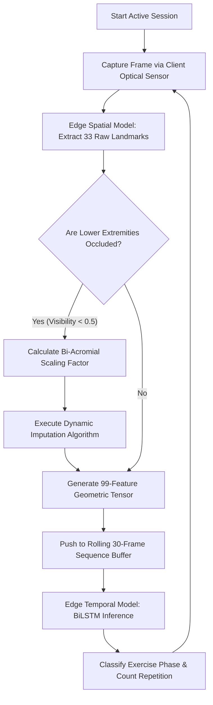
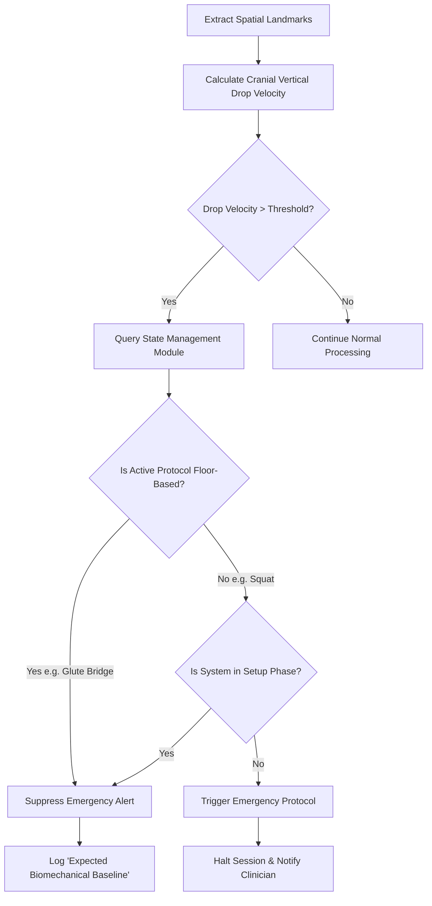
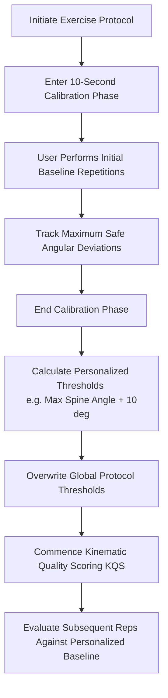

# FORM 2: PROVISIONAL PATENT SPECIFICATION (DIAGRAMS)

When submitting your patent application, the examiner will want to see "Flowcharts of the Algorithm" rather than standard software architecture diagrams. These diagrams demonstrate the specific *methods* and *processes* your system executes, proving it is a novel technical solution rather than an abstract idea.

You can use these flowcharts in your application (many patent attorneys use Mermaid or similar tools to generate the final black-and-white vector graphics required for formal filings).

---

## FIG 1: The Zero-Latency Edge Pipeline & Imputation Method
This diagram illustrates the core processing loop, specifically highlighting the novel **Dynamic Occlusion Imputation** method claimed in the specification.

---

## FIG 2: Contextual Safety Filter & Fall Suppression
This diagram illustrates how the system intelligently suppresses false-positive alerts, a core claim of the invention.

---

## FIG 3: Dynamic Personalized Biomechanical Calibration
This diagram proves the algorithm adapts to the specific patient rather than using hardcoded textbook thresholds, forming the basis for the multi-factor scoring claim.

---

### How to use these for filing:
1. **Reference them in the text:** In your Detailed Description, you will say *"Referring now to FIG. 1, a method for dynamic occlusion imputation is shown wherein..."*
2. **Convert to Drawings:** If you file a formal Non-Provisional Patent later, a patent draftsperson will take these exact logical flows and convert them into the standard black-and-white box drawings required by the USPTO or Indian Patent Office. For a Provisional Patent (PPA), these flowcharts as-is are perfectly acceptable to establish your priority date!
