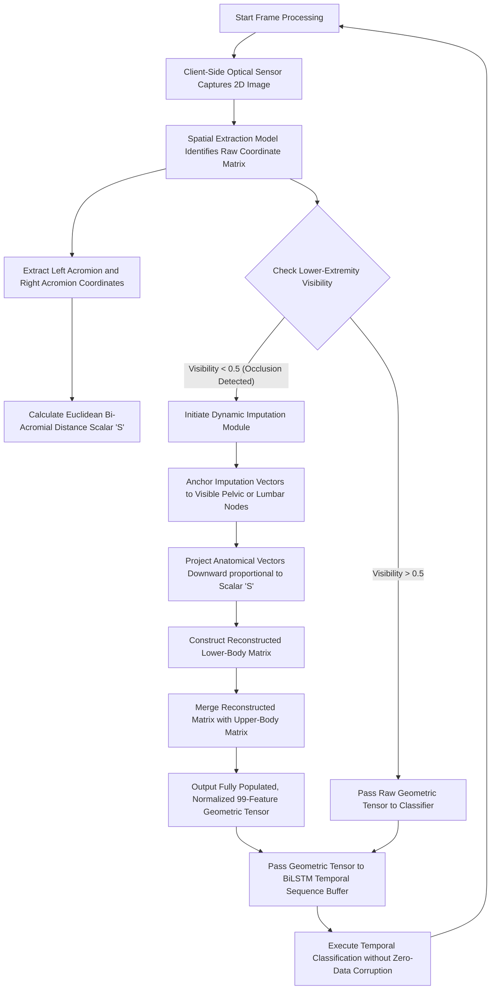

# FORM 2: PROVISIONAL PATENT SPECIFICATION (DIAGRAMS)

When submitting your patent application, the examiner requires detailed "Flowcharts of the Algorithm". Because we have narrowed the scope of the patent to focus exclusively on the **Virtual Landmark Reconstruction Algorithm**, the following diagram breaks down that specific mathematical process step-by-step. 

This proves to the examiner that this is a concrete, reproducible technical method.

---

## FIG 1: Method for Adaptive Anthropometric Imputation of Occluded Landmarks

---

### How to use this for filing:
1. **Reference it in the text:** In your Detailed Description, you will say *"Referring now to FIG. 1, a method for dynamic occlusion imputation via anthropometric scaling is shown..."*
2. **Convert to Drawings:** If you file a formal Non-Provisional Patent later, a patent draftsperson will take this exact logical flow and convert it into standard black-and-white box drawings required by the USPTO or Indian Patent Office. For a Provisional Patent (PPA), this flowchart as-is is perfectly acceptable to establish your priority date!
