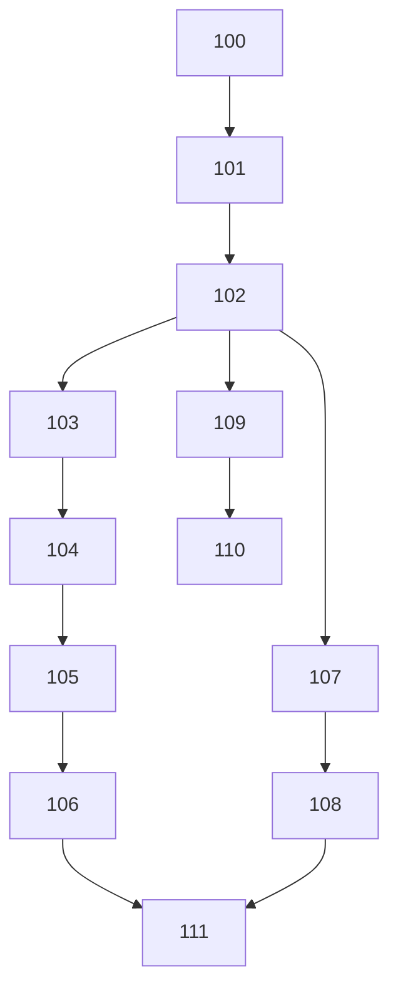
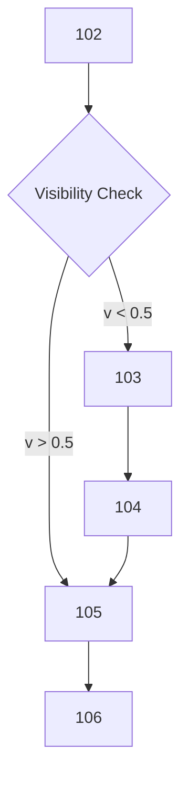
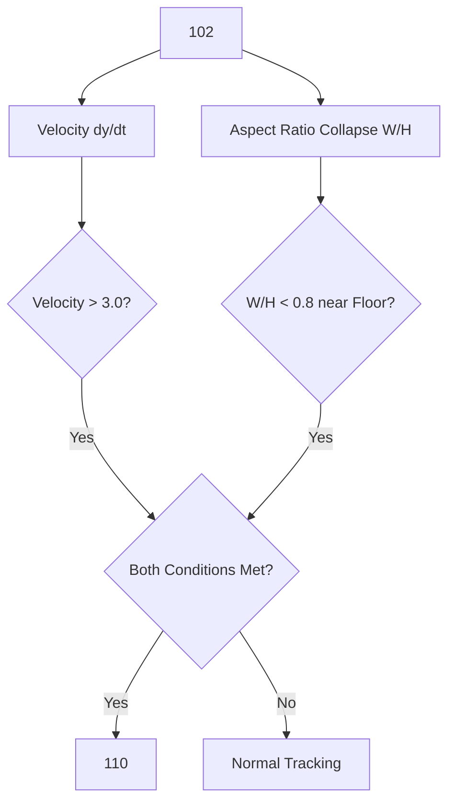
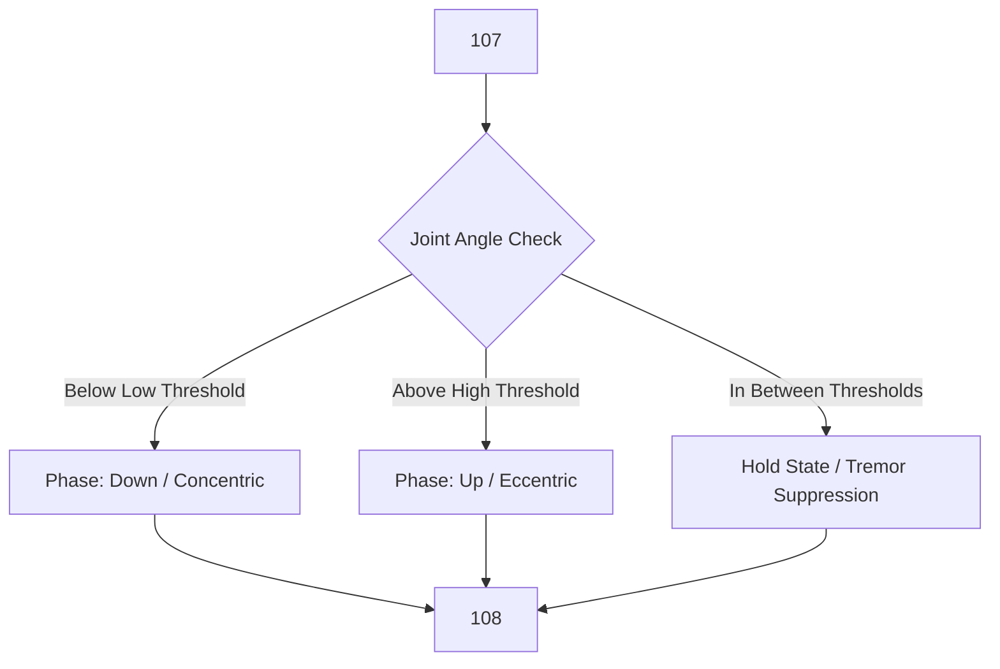
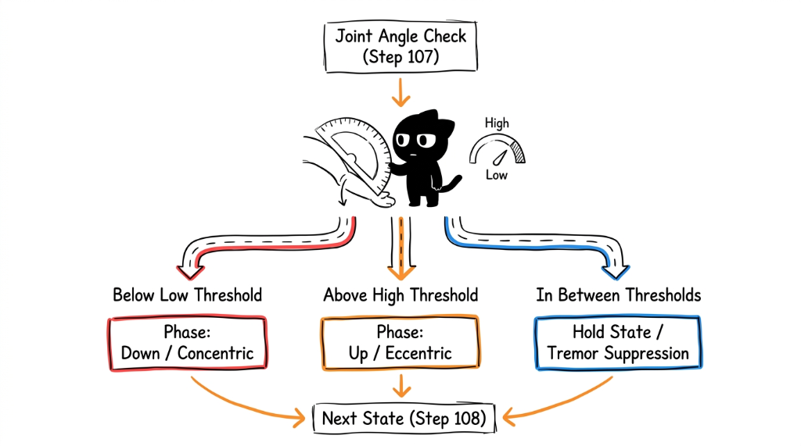

# PATENT APPLICATION SPECIFICATION DRAFT

**FORM 2 (PROVISIONAL / COMPLETE SPECIFICATION)**  
*(As per Indian Patents Act, 1970 & Institutional Guidelines)*

---

## 1. Full Name, Nationality and Address of Applicant(s)

| Full Name | Nationality | Address |
| :--- | :--- | :--- |
| **Vishwakarma Institute of Technology** | Indian | 666, Upper Indiranagar, Bibwewadi, Pune, Maharashtra, India – 411 037 |
| **Vishwakarma University** | Indian | Survey No 2, 3, 4, Kondhwa Main Rd, Laxmi Nagar, Betal Nagar, Kondhwa, Pune, Maharashtra, India - 411048 |

---

## 2. Full Name, Nationality, Address, Mail ID, and Phone Number of Inventor(s)

| Full Name (Including middle name) | Nationality | VIT Address (Dept. & Institute) | Mail ID | Phone No. |
| :--- | :--- | :--- | :--- | :--- |
| *[Inventor 1 Full Name]* | IN | Department of Computer Engineering, Vishwakarma Institute of Technology, Pune | *[Email ID 1]* | *[Phone 1]* |
| *[Inventor 2 Full Name]* | IN | Department of Electronics and Telecommunication Engineering, Vishwakarma Institute of Technology, Pune | *[Email ID 2]* | *[Phone 2]* |
| *[Inventor 3 Full Name]* | IN | Department of Computer Science & Engineering (Artificial Intelligence), Vishwakarma Institute of Technology, Pune | *[Email ID 3]* | *[Phone 3]* |
| *[Inventor 4 Full Name]* | IN | Department of Engineering Sciences & Humanities, Vishwakarma Institute of Technology, Pune | *[Email ID 4]* | *[Phone 4]* |

### Signatures of Inventors

| | | | |
| :---: | :---: | :---: | :---: |
| *[Insert Soft Copy Signature]* | *[Insert Soft Copy Signature]* | *[Insert Soft Copy Signature]* | *[Insert Soft Copy Signature]* |
| **Name 1:** *[Inventor 1 Name]* | **Name 2:** *[Inventor 2 Name]* | **Name 3:** *[Inventor 3 Name]* | **Name 4:** *[Inventor 4 Name]* |
| | | | |
| *[Insert Soft Copy Signature]* | *[Insert Soft Copy Signature]* | *[Insert Soft Copy Signature]* | *[Insert Soft Copy Signature]* |
| **Name 5:** *[Inventor 5 Name]* | **Name 6:** *[Inventor 6 Name]* | **Name 7:** *[Inventor 7 Name]* | **Name 8:** *[Inventor 8 Name]* |

---

## 3. Title of the Invention

**An Edge-Optimized Biomechanical Monitoring System for Real-Time Occluded Landmark Imputation and Wearable-Free Fall Detection**  
*(Word Count: 14 words)*

---

## 4. Technical Field of the Invention

The present invention relates generally to computer vision, human pose estimation, deep learning, and digital healthcare. More specifically, it relates to an edge-optimized software and hardware-assisted system for real-time biomechanical tracking, automated virtual skeletal landmark imputation using anthropometric scaling, ambient zero-wearable fall emergency detection, and adaptive hysteresis exercise form monitoring in remote physical rehabilitation environments.

---

## 5. Prior Art

Tele-rehabilitation and home-based physical therapy have increasingly relied on computer vision models to evaluate patient exercise execution. However, existing commercial and academic solutions exhibit major technical limitations:

1. **Catastrophic Occlusion & Field-of-View Collapse:** When patients undergo seated upper-body exercises or stand close to monocular webcams, their lower extremities (hips, knees, ankles) drop out of the camera's field of view or fall below spatial confidence thresholds ($v < 0.5$). Existing systems either fail completely or output zero-value vectors ($0.0, 0.0$), causing temporal neural network classifiers (e.g., BiLSTM/RNNs) to experience severe memory corruption and classification failure ($< 30\%$ accuracy).
2. **Reliance on Expensive Wearables:** Prior art fall detection mechanisms rely on wearable hardware (accelerometers, gyroscopes, smartwatches, or pendants). These introduce high financial cost, user discomfort, battery degradation, and compliance failure among elderly or mobility-impaired patients.
3. **High Latency & Cloud Data Privacy Risks:** Traditional AI rehabilitation platforms stream raw video feeds to remote cloud servers for heavy GPU processing. This introduces high network latency ($> 200\text{ ms}$), requires massive bandwidth, and exposes sensitive video data to cloud security vulnerabilities.
4. **False Repetition Counting from Tremors:** Single-threshold joint angle tracking in prior art causes severe rep double-counting whenever patients pause, shake, or experience muscle fatigue near transition angles.

---

## 6. Objective(s) of Invention

The primary objectives of the present invention are:
- **To provide uninterrupted spatial-temporal exercise classification** during lower-body or partial camera occlusions without relying on 3D depth sensors or heavy computation.
- **To enable zero-wearable, purely optical fall emergency detection** capable of mathematically distinguishing between intentional fast exercise movements (e.g., rapid squats) and actual gravitational collapses.
- **To execute end-to-end deep learning inference entirely on client-side Edge processors (Browser WebGL)** at 30 FPS, guaranteeing absolute patient data privacy and zero network latency.
- **To eliminate repetition double-counting** by introducing signal denoising and dynamic dual-threshold hysteresis state machines.

---

## 7. Synopsis

The present invention comprises a computer-implemented, edge-optimized biomechanical monitoring system for tele-rehabilitation. The system includes:
1. **A Monocular Optical Sensor (Webcam)** capturing continuous 2D video frames of a user performing exercises.
2. **A Client-Side Spatial Landmark Extractor** (MediaPipe BlazePose) deriving 33 3D skeletal landmarks $(x, y, z)$ and visibility metrics $(v)$.
3. **An Adaptive Anthropometric Scaling Imputation Engine** that dynamically computes an inter-shoulder (bi-acromial) scalar $S$ and projects proportional spatial vectors to reconstruct missing or occluded lower-extremity coordinates ($v < 0.5$), yielding a continuous 99-feature geometric tensor $(33 \times [x, y, v])$.
4. **An Edge-Based BiLSTM Temporal Classifier** running locally via TensorFlow.js (WebGL) over a 30-frame rolling window to classify exercise form without server dependence.
5. **An Ambient Fall Emergency Detection Engine** evaluating the instantaneous head velocity derivative ($dy/dt$) in parallel with 33-point bounding-box horizontal aspect ratio collapse ($W/H < 0.8$) near the floor to trigger immediate 10-second therapist emergency alerts.
6. **An Adaptive Hysteresis Repetition State Machine** integrated with an Exponential Moving Average (EMA, $\alpha=0.4$) filter to record verified exercise reps and biomechanical fatigue.

---

## 8. Brief Description of Drawings

The accompanying drawings illustrate the key components and operational logic of the proposed invention, wherein single common numerals are used to denote specific components:

- **Figure 1** illustrates the overall hardware and software system architecture of the edge-optimized biomechanical monitoring framework.
- **Figure 2** illustrates the flowchart of the adaptive anthropometric bi-acromial scaling imputation module for occluded skeletal joints.
- **Figure 3** illustrates the logical process of the dual-factor ambient fall detection algorithm.
- **Figure 4** illustrates the dual-threshold hysteresis state machine for noise-free exercise repetition tracking.

### Numeric Reference Callouts:
- **100**: Monocular Optical Sensor (Webcam)
- **101**: Client Edge Processor / WebGL Browser Runtime
- **102**: 33-Point Spatial Landmark Extractor
- **103**: Bi-Acromial Distance Calculation Unit
- **104**: Dynamic Vector Imputation Engine (Occlusion Fallback)
- **105**: 99-Feature Continuous Geometric Tensor Buffer
- **106**: Client-Side BiLSTM Temporal Neural Network Model
- **107**: Exponential Moving Average (EMA) Signal Denoising Filter ($\alpha=0.4$)
- **108**: Dual-Threshold Hysteresis Finite State Machine
- **109**: Ambient Fall Detection Module ($dy/dt$ + Aspect Ratio Collapse)
- **110**: Audio-Visual Feedback & Emergency Alert Dispatcher (10s Countdown)
- **111**: Cloud Microservice Backend & MongoDB Atlas Session Logger

---

## 9. Detailed Description of the Invention

Referring to **Figure 1**, the system captures continuous monocular video frames via **100**. The captured frames are processed locally by the client-side processor **101** using the spatial landmark extractor **102** to generate raw 3D coordinates $(x_i, y_i, z_i)$ and visibility scores $v_i$ for 33 body points.

### A. Dynamic Bi-Acromial Anthropometric Scaling & Imputation
When lower extremities are occluded ($v < 0.5$), the system routes raw data through **103** and **104**. 
The bi-acromial distance (shoulder width) scalar $S$ is calculated per frame using the left acromion $(x_{11}, y_{11})$ and right acromion $(x_{12}, y_{12})$:
$$S = \sqrt{(x_{12} - x_{11})^2 + (y_{12} - y_{11})^2}$$

If the visibility score of two or more lower-body joints (hips 23/24, knees 25/26, ankles 27/28) drops below $0.5$, **104** projects anatomically proportional vectors scaled by $S$:
$$Y_{hip} = \max(y_{11}, y_{12}) + 1.2 \cdot S$$
$$Y_{knee} = Y_{hip} + 1.5 \cdot S$$
$$Y_{ankle} = Y_{knee} + 1.5 \cdot S$$

The imputed spatial matrix is merged with visible upper-body coordinates to output a fully populated, normalized 99-feature tensor $(33 \text{ landmarks} \times 3 \text{ values } [x, y, v])$ into **105**.

### B. Client-Side Edge BiLSTM Temporal Classification
The 99-feature tensor buffer **105** maintains a rolling window of 30 frames ($30 \times 99$). The tensor is fed directly into **106**, a 64-unit Bidirectional Long Short-Term Memory (BiLSTM) network executing within the browser via WebGL. The network outputs Softmax probability vectors across trained exercise classes, achieving $>80\%$ classification accuracy during severe lower-body occlusions.

### C. Signal Denoising & Hysteresis Repetition Tracking
To calculate joint angles $\theta$, vectors $\vec{u} = A - B$ and $\vec{v} = C - B$ are derived. The angle is computed via:
$$\theta = \arccos\left( \frac{\vec{u} \cdot \vec{v}}{\|\vec{u}\| \|\vec{v}\|} \right) \times \left(\frac{180}{\pi}\right)$$

Raw joint angles are passed through an Exponential Moving Average filter **107**:
$$S_t = 0.40 \cdot Y_t + 0.60 \cdot S_{t-1}$$

Filtered angles are processed by **108** using high and low hysteresis boundaries (e.g., Knee Squats: concentric transition at $\theta < 100^\circ$, eccentric transition at $\theta > 150^\circ$), completely dampening muscular tremors and preventing double counts.

### D. Wearable-Free Ambient Fall Detection
In parallel, **109** evaluates the first derivative of the nose landmark velocity $V_{nose}$:
$$V_{nose} = \frac{|Y_{nose, t} - Y_{nose, t-1}|}{\Delta t}$$

If $V_{nose} > 3.0\text{ screen units/sec}$ AND the 33-point landmark bounding-box aspect ratio collapses horizontally ($W/H < 0.8$) near the floor plane ($|Y_{nose} - Y_{ankle}| < 0.20$), **109** confirms an emergency fall and activates **110** to initiate a 10-second therapist alert countdown and pause session logging to **111**.

---

## 10. Best Method of Performance of the Invention

The practical step-by-step working process of the invention is performed as follows:
1. **System Initialization:** The user opens the web application interface on a client device (laptop/tablet with standard 720p webcam).
2. **Dynamic Calibration Phase:** A 10-second dynamic baseline calibration is executed wherein the system measures the user's resting bi-acromial shoulder width $S$ and initial Range of Motion (ROM).
3. **Real-Time Frame Extraction:** Monocular 2D frames are ingested at 30 FPS. Landmark extractor **102** extracts 33 spatial nodes.
4. **Occlusion Check & Imputation:** If lower body joints drop out of view ($v < 0.5$), module **104** automatically computes standing leg coordinates using scale factor $S$ and updates the tensor buffer **105**.
5. **Edge AI Classification & Safety Loop:** Model **106** evaluates the 30-frame sequence for exercise form. Simultaneously, fall module **109** monitors $V_{nose}$ velocity and bounding-box ratio. If an anomaly or fall occurs, audio warning **110** fires immediately.
6. **Session Cloud Sync:** Aggregated rep metrics, fatigue scores, and safety logs are asynchronously synced to **111** (MongoDB Atlas) without streaming raw video.

---

## 11. CLAIMS

**We Claim:**

1. **Claim 1 (Independent - Wearable-Free Fall Detection):**  
   A computer-implemented method for wearable-free optical fall detection during physical rehabilitation, comprising:
   - capturing a continuous sequence of two-dimensional image frames via a monocular optical sensor;
   - tracking spatial coordinates of a plurality of skeletal landmarks, including a head landmark and an ankle landmark;
   - calculating an instantaneous downward velocity derivative of said head landmark across consecutive frames;
   - computing a bounding-box horizontal aspect ratio across all visible skeletal landmarks; and
   - triggering an emergency fall alert when said downward velocity derivative exceeds a predefined velocity threshold AND said bounding-box horizontal aspect ratio collapses horizontally below a predefined collapse threshold near a floor plane.

2. **Claim 2 (Dependent on Claim 1):**  
   The method of Claim 1, further comprising executing a 10-second client-side alert countdown upon fall detection, automatically pausing exercise logging, and transmitting an emergency alert signal to a remote therapist dashboard.

3. **Claim 3 (Independent - Anthropometric Occlusion Imputation):**  
   A computer-implemented method for reconstructing occluded skeletal landmarks during monocular pose tracking, comprising:
   - extracting spatial skeletal coordinates and joint visibility confidence scores from monocular video frames;
   - calculating a dynamic anthropometric scaling scalar derived from the Euclidean distance between a pair of shoulder landmarks;
   - detecting an occlusion event when visibility scores of lower-extremity landmarks drop below a confidence threshold;
   - dynamically imputing spatial coordinates for said occluded lower-extremity landmarks by projecting downward spatial vectors proportional to said dynamic anthropometric scaling scalar; and
   - passing a fully populated geometric tensor comprising both extracted and imputed coordinates into a temporal neural network for sequence classification.

4. **Claim 4 (Dependent on Claim 3):**  
   The method of Claim 3, wherein the temporal neural network is a Bidirectional Long Short-Term Memory (BiLSTM) network running locally within a client browser volatile memory via WebGL, maintaining sequence classification accuracy above 80% during lower-body occlusion.

5. **Claim 5 (Independent - Integrated Edge System):**  
   A real-time tele-rehabilitation monitoring system comprising:
   - a monocular optical sensor capturing user movement;
   - a client edge processor configured to execute spatial pose extraction, bi-acromial anthropometric occlusion imputation, Exponential Moving Average signal filtering, and BiLSTM temporal exercise classification entirely within client-side memory; and
   - a microservice backend configured to receive encrypted session telemetry without ingesting raw video streams.

---

## 12. Inventive Step of your Invention

The inventive step of the present invention resides in the technical and economic advantages achieved over existing technology:
- **Technical Advantage in Computer Vision:** Unlike prior art that fails or outputs zero-tensors during partial camera framing, the bi-acromial distance scaling mathematically reconstructs anatomically plausible skeletal proportions, preserving BiLSTM ML classification accuracy ($>80\%$) without demanding 3D sensors or heavy cloud GPU infrastructure.
- **Novel Optical Fall Detection Logic:** By combining $dy/dt$ nose velocity spikes with bounding-box aspect ratio collapse, the system solves the long-standing problem of false-positive fall alerts triggered by rapid squats or push-ups.
- **Economic & Operational Advantage:** Running 100% client-side WebGL Edge AI reduces cloud hosting infrastructure costs to near zero, eliminates server network bottlenecks, and guarantees strict compliance with healthcare data privacy laws (HIPAA/GDPR).

---

## 13. Industrial Application

The present invention has direct industrial utility across multiple digital health and commercial domain sectors:
- **Telehealth & Remote Physical Rehabilitation:** Providing objective, home-based biomechanical monitoring for post-operative orthopedic and stroke recovery patients.
- **Elderly Care & Assisted Living Safety:** Wearable-free fall detection and emergency response monitoring in elder care facilities.
- **Smart Fitness & Connected Gym Equipment:** Edge-based AI form correction in consumer smart mirrors, mobile apps, and home gym platforms.
- **Sports Science & Ergonomic Kinematics:** Quantitative gait, fatigue, and posture assessment in athletic training and workplace ergonomic safety.

---

## 14. Abstract

A computer-implemented system and method for real-time, wearable-free biomechanical monitoring and automated emergency fall detection during remote physical rehabilitation. The system receives sequential monocular image frames from a client capture device (100) and extracts 33 spatial skeletal landmarks (102). To maintain temporal classification accuracy when a patient's lower extremities are occluded, a dynamic imputation engine (104) derives a bi-acromial scaling factor from shoulder landmarks (103) and projects anatomically proportional vectors to reconstruct missing joint coordinates. The fully populated 99-feature geometric tensor (105) is processed locally by a client-side WebGL BiLSTM temporal neural network (106) to evaluate exercise form. Concurrently, an ambient fall detection module (109) analyzes the instantaneous head velocity derivative ($dy/dt$) alongside bounding-box horizontal aspect ratio collapse near the floor to distinguish exercise movements from true gravitational falls, triggering automated emergency therapist alerts (110) upon anomaly detection.

---

## 15. Drawing

*(Note: Per Patent Office guidelines, drawings contain numbers only without embedded text labels)*

### Figure 1: System Hardware and Edge AI Flowchart

### Figure 2: Occluded Skeletal Landmark Imputation Flowchart

### Figure 3: Wearable-Free Ambient Fall Detection Logic

### Figure 4: Dual-Threshold Hysteresis State Machine

#### Formal Patent Office Specification Flowchart (IPO Form-2 Compliant)

#### Presentation & PPT Visual Diagram (Illustrated Meme / Defense Slide Diagram)

