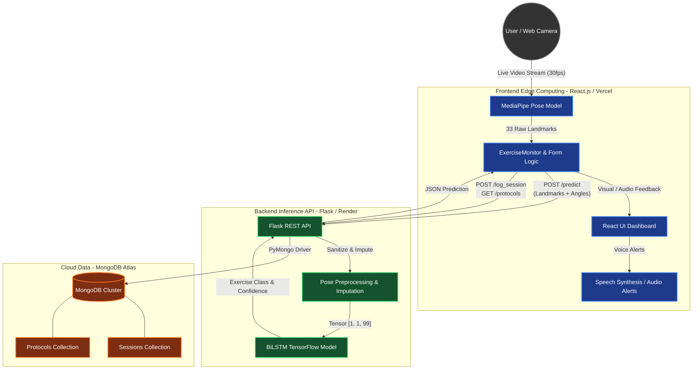
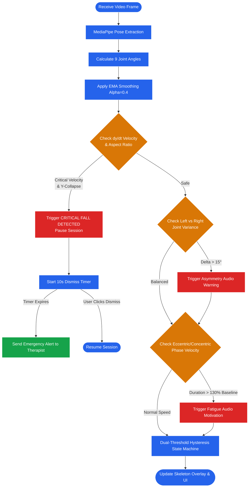
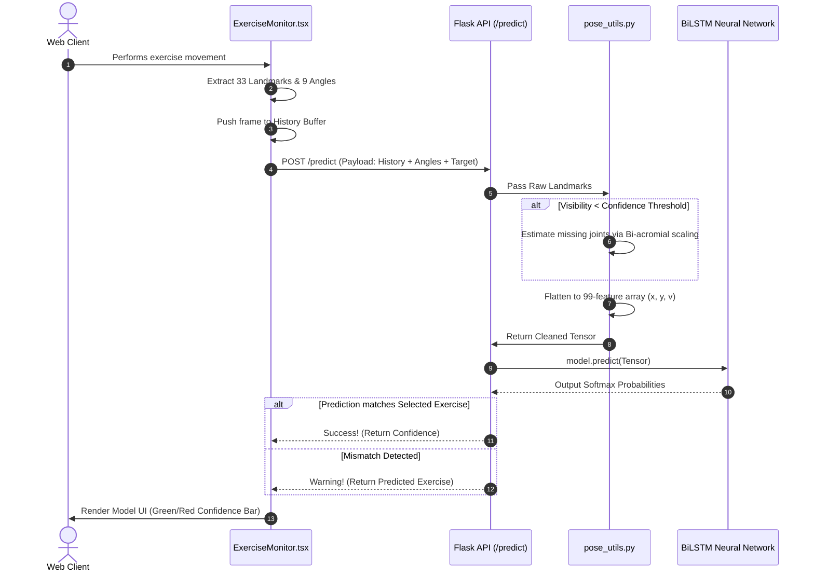

# PhysioTracker: System Architecture & Flow Diagrams

This document contains the structural architecture and execution workflows of the PhysioTracker platform. These diagrams accurately reflect the production implementation, including the advanced biomechanical features and emergency fall detection.

## 1. High-Level System Architecture

This diagram illustrates the separation of concerns between the client-side edge computing (MediaPipe), the RESTful ML API, and the persistence layer.

---

## 2. Real-Time Form Analysis & Fall Detection Flow

This flowchart describes the 30fps client-side loop that evaluates patient safety and tracks adaptive exercise repetitions without making external network calls.

---

## 3. Machine Learning Inference Pipeline

This sequence details how the raw camera data is transformed into a BiLSTM prediction via the backend API.

