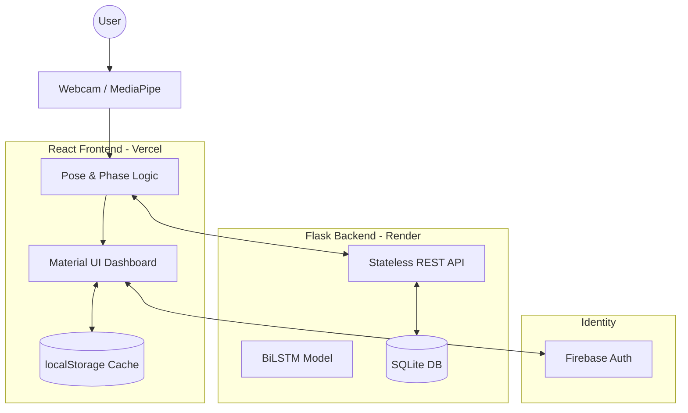

# System Architecture: Physiotherapy Monitoring Platform

This document outlines the production-ready architecture of the Physiotherapy Monitoring System, emphasizing scalability, real-time responsiveness, and mathematical accuracy.

## 1. High-Level Architecture

The system follows a modern decoupled architecture with a **Stateless Inference Engine** (Backend) and an **Intelligent Tracking Client** (Frontend).

---

## 2. Component Breakdown

### A. Frontend (React + MediaPipe)
*   **Role**: Real-time pose extraction, UI/UX, and repetition counting logic.
*   **Technologies**: React 18, Material UI, MediaPipe Pose.
*   **Key Logic**: 
    *   **Phase Detection**: Uses a hysteresis-based algorithm (High/Low thresholds) to count repetitions locally.
    *   **Performance**: Implements `localStorage` caching for exercise lists and dashboard data to mitigate backend cold starts.
    *   **Audio**: Instant voice feedback via the Web Speech API.

### B. Backend (Flask + TensorFlow)
*   **Role**: Stateless exercise classification (Inference) and session logging.
*   **Technologies**: Flask (Gunicorn), TensorFlow 2.13 (CPU), Scikit-Learn.
*   **Key Logic**:
    *   **Stateless Inference**: Receives 33 raw landmarks, transforms them into a 30-timestep sequence, and predicts the exercise type using a BiLSTM model.
    *   **Concurrency**: Optimized for Gunicorn with safe database initialization to support multi-worker environments.

### C. Database (SQLite)
*   **Role**: Persistent storage for user sessions and exercise history.
*   **Location**: Managed as a persistent volume or local file (`physio_sessions.db`) on the Render instance.

---

## 3. Data Flow (Predictive Loop)

1.  **Capture**: Frontend captures video frames from the user's webcam.
2.  **Extract**: MediaPipe Pose extracts 33 landmark points (x, y, visibility).
3.  **Local Process**: Frontend calculates 9 joint angles (Shoulder, Elbow, Hip, Knee, Spine) using the corrected anatomical mapping.
4.  **Inference**: Raw landmarks are sent to the `/predict` endpoint.
5.  **Classify**: Backend BiLSTM model returns the predicted exercise and confidence level.
6.  **Count**: Frontend updates the local `repCount` based on detected phase transitions (e.g., Down -> Up).
7.  **Finalize**: Upon stopping, the session summary is logged to the backend for permanent storage.

---

## 4. Key Algorithms

### Hysteresis-Based Counting
To prevent flickering reps due to noise, the system uses two thresholds per exercise:
*   **Down Threshold**: The angle must go *below* this value to start the negative phase (e.g., < 100° for a Squat).
*   **Up Threshold**: The angle must return *above* this value to complete the positive phase and count a rep (e.g., > 150°).

### Anatomical Angle Mapping
*   **Shoulder Angle**: Calculated using the `Hip -> Shoulder -> Elbow` vertices.
*   **Elbow Angle**: Calculated using the `Shoulder -> Elbow -> Wrist` vertices.

---

## 5. Security & Authentication

*   **Firebase Auth**: Handles Google OAuth and Email/Password flows.
*   **Stateless Security**: Backend requests are authenticated via Firebase UID verification in production logs.
*   **Environment Variables**: Secure management of API Keys and Backend URLs via `.env` files and Vercel/Render secrets.

---

## 6. Infrastructure & Deployment

| Layer | Platform | Optimization |
| :--- | :--- | :--- |
| **Frontend** | Vercel | Global CDN, Automated CI/CD |
| **Backend** | Render | Gunicorn Workers, Stateless Inference |
| **MediaPipe** | jsDelivr | CDN-hosted model assets for fast loading |
| **Database** | SQLite | Persistent local storage |
